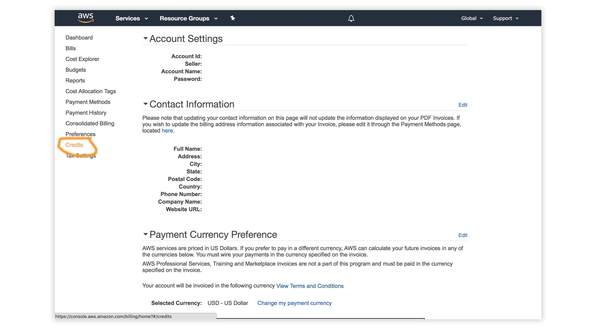

# Building real-time applications with iOS, GraphQL & AWS AppSync

In this workshop we'll learn how to build cloud-enabled native iOS apps with Swift & [AWS Amplify](https://aws-amplify.github.io/).


### Topics we'll be covering:

- [GraphQL API with AWS AppSync](https://github.com/dennisAWS/aws-appsync-ios-workshop#getting-started---create-an-xcode-project)
- [Authentication](https://github.com/dennisAWS/aws-appsync-ios-workshop#adding-authentication)
- [Adding Authorization to the AWS AppSync API](https://github.com/dennisAWS/aws-appsync-ios-workshop#adding-authorization-to-the-graphql-api)
- [Creating & working with multiple serverless environments](https://github.com/dennisAWS/aws-appsync-ios-workshop#multiple-serverless-environments)
- [Deleting the resources](https://github.com/dennisAWS/aws-appsync-ios-workshop#removing-services)

## Redeeming the AWS Credit   

1. Visit the [AWS Console](https://console.aws.amazon.com/console).
2. In the top right corner, click on __My Account__.

3. In the left menu, click __Credits__.


## Getting Started - Create an Xcode project

To get started, we first need to create a new Xcode project & change into the new directory.

Launch Xcode and create a new iOS project and save as ios-amplify-app

Now change into the new app directory & install the Amplify CLI:

## Installing the CLI & Initializing a new AWS Amplify Project

### Installing the CLI

Next, we'll install the AWS Amplify CLI:

```bash
npm install -g @aws-amplify/cli
```

Now we need to configure the CLI with our credentials:

```js
amplify configure
```

> If you'd like to see a video walkthrough of this configuration process, click [here](https://www.youtube.com/watch?v=fWbM5DLh25U).

Here we'll walk through the `amplify configure` setup. Once you've signed in to the AWS console, continue:
- Specify the AWS Region: __us-east-1__
- Specify the username of the new IAM user: __amplify-workshop-user__
> In the AWS Console, click __Next: Permissions__, __Next: Tags__, __Next: Review__, & __Create User__ to create the new IAM user. Then, return to the command line & press Enter.
- Enter the access key of the newly created user:   
? accessKeyId: __(<YOUR_ACCESS_KEY_ID>)__   
? secretAccessKey:  __(<YOUR_SECRET_ACCESS_KEY>)__
- Profile Name: __amplify-workshop-user__

### Initializing A New Project

```bash
amplify init
```

- Enter a name for the project: __iosamplifyapp__
- Enter a name for the environment: __master__
- Choose your default editor: __Visual Studio Code (or your default editor)__   
- Please choose the type of app that you're building __ios__     
- Do you want to use an AWS profile? __Y__
- Please choose the profile you want to use: __amplify-workshop-user__

Now, the AWS Amplify CLI has iniatilized a new project & you will see a new folder: __amplify__ & a new file called `awsconfiguration.json` in the root directory. These files holds your project configuration.

To view the status of the amplify project at any time, you can run the Amplify `status` command:

```sh
amplify status
```

### Configuring the iOS applicaion

Now, our resources are created & we can start using them!

To configure the app, we'll use Cocoapods to install the AWS SDK for iOS and AWS AppSync dependancies.
In the root project folder, run the following command to initialize Cocoapods.

```js
pod init
```

This will create a `Podfile`. Open up the `Podfile` and add the following dependancies:

```js
target 'ios-amplify-app' do
  # Comment the next line if you're not using Swift and don't want to use dynamic frameworks
  use_frameworks!

  # Pods for ios-amplify-app
  pod 'AWSAppSync', ' ~> 2.10.0'
  
end
```

Install the AppSync iOS SDK by running:
```js
pod install --repo-update
```

Now, our iOS app is ready to start using our AWS services.

## Adding a GraphQL API

To add a GraphQL API, we can use the following command:

```sh
amplify add api
```

Answer the following questions

- Please select from one of the above mentioned services __GraphQL__   
- Provide API name: __ConferenceAPI__   
- Choose an authorization type for the API __API key__   
- Do you have an annotated GraphQL schema? __N__   
- Do you want a guided schema creation? __Y__   
- What best describes your project: __Single object with fields (e.g. “Todo” with ID, name, description)__   
- Do you want to edit the schema now? (Y/n) __Y__   

> When prompted, update the schema to the following:   

```graphql
type Talk @model {
  id: ID!
  clientId: ID
  name: String!
  description: String!
  speakerName: String!
  speakerBio: String!
}
```

> Next, let's deploy the API into our account:

```bash
amplify push
```

- Do you want to generate code for your newly created GraphQL API __Y__
- Enter the file name pattern of graphql queries, mutations and subscriptions: __(graphql/**/*.graphql)__
- Do you want to generate/update all possible GraphQL operations - queries, mutations and subscriptions? __Y__
- Enter maximum statement depth [increase from default if your schema is deeply nested] __2__
- Enter the file name for the generated code __API.swift__

> To view the new AWS AppSync API at any time after its creation, go to the dashboard at [https://console.aws.amazon.com/appsync](https://console.aws.amazon.com/appsync). Also be sure that your region is set correctly.

### Performing mutations from within the AWS AppSync Console

In the AWS AppSync console, open your API & then click on Queries.

Execute the following mutation to create a new talk in the API:

```graphql
mutation createTalk {
  createTalk(input: {
    name: "Monetize your Mobile Apps"
    description: "4 ways to make money as a mobile app developer"
    speakerName: "Dennis"
    speakerBio: "Mobile Quickie Developer"
  }) 
  {
      id 
      name 
      description 
      speakerName 
      speakerBio
  }
}
```

Now, let's query for the talk:

```graphql
query listTalks {
  listTalks {
    items {
      id
      name
      description
      speakerName
      speakerBio
    }
  }
}
```

We can even add search / filter capabilities when querying:

```graphql
query listTalks {
  listTalks(filter: {
    description: {
      contains: "money"
    }
  }) {
    items {
      id
      name
      description
      speakerName
      speakerBio
    }
  }
}
```

### Add the AWSConfiguration.json file to your Xcode project

We need to configure our iOS Swift application to be aware of our new AWS Amplify project. We do this by referencing the auto-generated `awsconfiguration.json` file that is now in root of our Xcode project folder.

Launch Xcode 
```js
open ios-amplify-app.xcworkspace/
```

In the Finder, drag `awsconfiguration.json` into Xcode under the top Project Navigator folder. When the Options dialog box that appears, do the following:

* Clear the Copy items if needed check box.
* Choose Create groups, and then choose Next.

### Interacting with the GraphQL API from our client application - Querying for data

Now that the GraphQL API is created we can begin interacting with it!

The first thing we'll do is perform a query to fetch data from our API.

To do so, we need to define the query and execute the query.

#### Integrate AppSync into your iOS app (part 1) - `AppDelegate.swift`

```swift
import UIKit
import AWSAppSync // #1

@UIApplicationMain
class AppDelegate: UIResponder, UIApplicationDelegate {

    var window: UIWindow?
    
    var appSyncClient: AWSAppSyncClient? // #2

    func application(_ application: UIApplication, didFinishLaunchingWithOptions launchOptions: [UIApplication.LaunchOptionsKey: Any]?) -> Bool {
        
        // BEGIN #3 AppSync
        do {
            // Directory in which AppSync stores its persistent cache databases
            let cacheConfiguration = try AWSAppSyncCacheConfiguration()
            
            // AppSync configuration & client initialization
            let appSyncServiceConfig = try AWSAppSyncServiceConfig()
            let appSyncConfig = try AWSAppSyncClientConfiguration(appSyncServiceConfig: appSyncServiceConfig, cacheConfiguration: cacheConfiguration)
                appSyncClient = try AWSAppSyncClient(appSyncConfig: appSyncConfig)
        } catch {
            print("Error initializing appsync client. \(error)")
        }
        // END #3 AppSync
        
        return true
    }

    //...
}
```

#### Integrate into your app (part 2) - `ViewController.swift`

Add the following three items to your ViewController
```swift
import UIKit
import AWSAppSync // #1

class ViewController: UIViewController {

    // Reference AppSync client
    var appSyncClient: AWSAppSyncClient? // #2
    
    override func viewDidLoad() {
        super.viewDidLoad()
        
        // #3
        let appDelegate = UIApplication.shared.delegate as! AppDelegate
                appSyncClient = appDelegate.appSyncClient
    }
}
```

## Performing Mutations

Now, let's look at how we can create mutations in Swift.

Add the following function in `ViewController.swift`:

```swift
    // GraphQL Mutation - Add a new talk
    func createTalkMutation(){
        let conferenceInput = CreateTalkInput(name: "Monetize your iOS app", description: "How to make dough as an iOS developer", speakerName: "Steve Jobs", speakerBio: "I do cool stuff at Apple")
        appSyncClient?.perform(mutation: CreateTalkMutation(input: conferenceInput))
        { (result, error) in
            if let error = error as? AWSAppSyncClientError {
                print("Error occurred: \(error.localizedDescription )")
            }
            if let resultError = result?.errors {
                print("Error saving conf talk: \(resultError)")
                return
            }
            
            guard let result = result?.data else { return }
            
            print("Talk created: \(String(describing: result.createTalk?.id))")
        }
    }
```

## Performing Queries

Next, we'll perform a query to fetch data from our API with a new function in `ViewController.swift`.

```swift
// GraphQL Query - List all talks
    func getTalksQuery(){
        appSyncClient?.fetch(query: ListTalksQuery(), cachePolicy: .returnCacheDataAndFetch) { (result, error) in
            if error != nil {
                print(error?.localizedDescription ?? "")
                return
            }
            
            guard let talks = result?.data?.listTalks?.items else { return }
            talks.forEach{ print(("Title: " + ($0?.name)!) + "\nSpeaker: " + (($0?.speakerName)! + "\n")) }
        }
    }
```

### Run App and take a quick break

In order te execute the mutation and query functions above, we'll need to call these functions from ViewDidLoad() as shown:
```swift
override func viewDidLoad() {
        super.viewDidLoad()
        
        //...

        createTalkMutation()
        getTalksQuery()
      
        //...
    }
```

### GraphQL Subscriptions

Next, let's see how we can create a subscription to subscribe to data changes in our API.

To do so, we need to define the subscription, listen for the subscription, & update the the UI (or log it) whenever new data comes in through the subscription.

```swift
// Set a discard variable at the class level
var discard: Cancellable?
```

Now add this subscribe function to your `ViewController.swift` file: 

```swift
func subscribeToTalks() {
        do {
            discard = try appSyncClient?.subscribe(subscription: OnCreateTalkSubscription(), resultHandler: { (result, transaction, error) in
                if let result = result {
                    print("Subscription triggered! " + result.data!.onCreateTalk!.name + " " + result.data!.onCreateTalk!.speakerName)
                } else if let error = error {
                    print(error.localizedDescription)
                }
            })
        } catch {
            print("Error starting subscription.")
        }
    }
```

Finally, call the `subscribeToTalks()` function from the ViewDidLoad():
```swift
override func viewDidLoad() {
        super.viewDidLoad()
        
        // ...
        
        // subscription to newly created talks
        subscribeToTalks()
    }
```

Let's run the app and then add a new talk via the AppSync Console and we should see the iOS app log the new talk via real-tine subscription!

## Adding Authentication

To add authentication, we can use the following command:

```sh
amplify add auth
```

- __Do you want to use default authentication and security configuration?__, choose __Default configuration__   
- How do you want users to be able to sign in when using your Cognito User Pool? __Username__   
- What attributes are required for signing up? __Email__ (keep default)

Now, we'll run the push command and the cloud resources will be created in our AWS account.

```bash
amplify push
```

> To view the new Cognito authentication service at any time after its creation, go to the dashboard at [https://console.aws.amazon.com/cognito/](https://console.aws.amazon.com/cognito/). Also be sure that your region is set correctly.

### Update Podfile to use Auth from AWS SDK

Open up the Podfile and add the following dependancies:
```js
target 'ios-amplify-app' do
  # Comment the next line if you're not using Swift and don't want to use dynamic frameworks
  use_frameworks!

  # Pods for ios-amplify-app
  pod 'AWSAppSync', ' ~> 2.10.0'  # Already added previously
  pod 'AWSMobileClient', '~> 2.9.0'      # Required dependency
  pod 'AWSAuthUI', '~> 2.9.0'            # Optional dependency required to use drop-in UI
  pod 'AWSUserPoolsSignIn', '~> 2.9.0'   # Optional dependency required to use drop-in UI
end
```

Now run a Pod install:

```bash
pod install
```

### Using the AWSMobileClient

To add authentication to our iOS app, we'll go into __AppDelegate.swift__ and first import the `AWSMobileClient`:

```swift
import AWSMobileClient
```

Next, we'll initialize the `AWSMobileClient` in the ViewDidLoad() function in the `ViewController.swift` file:

```swift
AWSMobileClient.sharedInstance().initialize { (userState, error) in
    if let userState = userState {
            switch(userState){
            case .signedIn: // is Signed IN
                print("Logged In")
                print("Cognito Identity Id (authenticated): \(String(describing: AWSMobileClient.sharedInstance().identityId))")
            case .signedOut: // is Signed OUT
                print("Logged Out")
                print("Cognito Identity Id (unauthenticated): \(String(describing: AWSMobileClient.sharedInstance().identityId))")
                DispatchQueue.main.async {
                    self.showSignIn()
                }
            default:
                AWSMobileClient.sharedInstance().signOut()
            }
        } else if let error = error {
            print(error.localizedDescription)
        }
}
```

Last, we'll add the iOS SDK drop-in UI code in the `ViewController.swift` file to show our login UI if the user is not authenticated:

```swift
// Use the iOS SDK Auth UI to show login options to user (Basic auth, Google, or Facebook)
func showSignIn() {
    AWSMobileClient.sharedInstance().showSignIn(navigationController: self.navigationController!, {
        (userState, error) in
        if(error == nil){   // Successful signin
            DispatchQueue.main.async {
                print("User successfully logged in")
            }
        }
    })
}
```

IMPORTANT: The drop-in UI requires the use of a navigation controller to anchor the view controller. Please make sure the app has an active navigation controller which is passed to the navigationController parameter.

Now, we can run the app and see the Auth Drop in UI in action. This drop in UI provides a built-in UI giving users the ability to sign up & sign in via Amazon Cognito User Pools.

> To view the new user that was created in Cognito, go back to the dashboard at [https://console.aws.amazon.com/cognito/](https://console.aws.amazon.com/cognito/). Also be sure that your region is set correctly.

## Adding Authorization to the GraphQL API

Next we need to update the AppSync API to now use the newly created Cognito Authentication service as the authentication type. Remember, we previously setup authorization via an API Key for testing.

To do so, we'll reconfigure the existing GraphQL API:

```sh
amplify configure api
```
Please select from one of the below mentioned services: __GraphQL__   
Choose an authorization type for the API: __Amazon Cognito User Pool__

Next, we'll run `amplify push`:

```sh
amplify push
```

Now, we can only access the API with a logged in user.

#### Advanced Use Case for Authenticated Users

Next, let's look at how to use the identity of the user to associate items created in the database with the logged in user & then query the database using these credentials.

To do so, we'll store the user's identity in the database table as userId & add a new index on the table to query for this user ID.

#### Adding an index to the table

Next, we'll want to add a new GSI (global secondary index) in the table. We do this so we can query on the index to gain new data access pattern.

To add the index, open the [AppSync Console](https://console.aws.amazon.com/appsync/home), choose your API & click on __Data Sources__. Next, click on the data source link.

From here, click on the __Indexes__ tab & click __Create index__.

For the __partition key__, input `userId` to create a `userId-index` Index name & click __Create index__.

Next, we'll update the resolver for adding talks & querying for talks.

#### Updating the resolvers

In the folder __amplify/backend/api/ConferenceAPI/resolvers__, create the following two resolvers:

__Mutation.createTalk.req.vtl__ & __Query.listTalks.req.vtl__.

__Mutation.createTalk.req.vtl__

```vtl
$util.qr($context.args.input.put("createdAt", $util.time.nowISO8601()))
$util.qr($context.args.input.put("updatedAt", $util.time.nowISO8601()))
$util.qr($context.args.input.put("__typename", "Talk"))
$util.qr($context.args.input.put("userId", $ctx.identity.sub))

{
  "version": "2017-02-28",
  "operation": "PutItem",
  "key": {
      "id":     $util.dynamodb.toDynamoDBJson($util.defaultIfNullOrBlank($ctx.args.input.id, $util.autoId()))
  },
  "attributeValues": $util.dynamodb.toMapValuesJson($context.args.input),
  "condition": {
      "expression": "attribute_not_exists(#id)",
      "expressionNames": {
          "#id": "id"
    }
  }
}
```

__Query.listTalks.req.vtl__

```vtl
{
    "version" : "2017-02-28",
    "operation" : "Query",
    "index" : "userId-index",
    "query" : {
        "expression": "userId = :userId",
        "expressionValues" : {
            ":userId" : $util.dynamodb.toDynamoDBJson($ctx.identity.sub)
        }
    }
}
```

Next, run the push command again to update the API:

```sh
amplify push
```

> Now that we've added authorization to the API, the users will need to log in (via username/password) if we would like to perform queries in the AppSync Console. To log in, find the `aws_user_pools_web_client_id` in the `AWSConfiguration.json` file & log in using your `username` & `password`.

Now when we create new talks, the `userId` field will be populated with the `userId` of the authenticated (logged in) user.

When we query for the talks, we will only receive the talk data for the items that were created by the authenticated user.

```graphql
query listTalks {
  listTalks {
    items {
      id
      name
      description
      speakerName
      speakerBio
    }
  }
}
```

#### Creating custom resolvers

Now let's say we want to define & use a custom GraphQL operation & create corresponding resolvers that do not yet exist? We can also do that using Amplify & the local environment.

Let's create a query & resolvers that will query for __all__ talks in the API, similar to the functionality we had before changing the `listTalks` resolver.

To do so, we need to do three things:

1. Define the operations we'd like to have available in our schema (add queries, mutations, subscriptions to __schema.graphql__).

To do so, update __amplify/backend/api/ConferenceAPI/schema.graphql__ to the following:

```graphql
type Talk @model {
  id: ID!
  clientId: ID
  name: String!
  description: String!
  speakerName: String!
  speakerBio: String!
}

type ModelTalkConnection {
  items: [Talk]
  nextToken: String
}

type Query {
  listAllTalks(limit: Int, nextToken: String): ModelTalkConnection
}
```

2. Create the request & response mapping templates in __amplify/backend/api/ConferenceAPI/resolvers__.

__Query.listAllTalks.req.vtl__

```vtl
{
    "version" : "2017-02-28",
    "operation" : "Scan",
    "limit": $util.defaultIfNull(${ctx.args.limit}, 20),
    "nextToken": $util.toJson($util.defaultIfNullOrBlank($ctx.args.nextToken, null))
}
```

__Query.listAllTalks.res.vtl__

```vtl
{
    "items": $util.toJson($ctx.result.items),
    "nextToken": $util.toJson($util.defaultIfNullOrBlank($context.result.nextToken, null))
}
```

3. Update __amplify/backend/api/ConferenceAPI/stacks/CustomResources.json__ with the definition of the custom resource.

Update the `Resources` field in __CustomResources.json__ to the following:

```json
{
  ...rest of template,
  "Resources": {
    "QueryListAllTalksResolver": {
      "Type": "AWS::AppSync::Resolver",
      "Properties": {
        "ApiId": {
          "Ref": "AppSyncApiId"
        },
        "DataSourceName": "TalkTable",
        "TypeName": "Query",
        "FieldName": "listAllTalks",
        "RequestMappingTemplateS3Location": {
          "Fn::Sub": [
            "s3://${S3DeploymentBucket}/${S3DeploymentRootKey}/resolvers/Query.listAllTalks.req.vtl",
            {
              "S3DeploymentBucket": {
                "Ref": "S3DeploymentBucket"
              },
              "S3DeploymentRootKey": {
                "Ref": "S3DeploymentRootKey"
              }
            }
          ]
        },
        "ResponseMappingTemplateS3Location": {
          "Fn::Sub": [
            "s3://${S3DeploymentBucket}/${S3DeploymentRootKey}/resolvers/Query.listAllTalks.res.vtl",
            {
              "S3DeploymentBucket": {
                "Ref": "S3DeploymentBucket"
              },
              "S3DeploymentRootKey": {
                "Ref": "S3DeploymentRootKey"
              }
            }
          ]
        }
      }
    }
  },
  ...rest of template,
}
```

Now that everything has been updated, run the push command again:

```sh
amplify push
```

## Multiple Serverless Environments

Now that we have our API up & running, what if we wanted to update our API but wanted to test it out without it affecting our existing version?

To do so, we can create a clone of our existing environment, test it out, & then deploy & test the new resources.

Once we are happy with the new feature, we can then merge it back into our main environment. Let's see how to do this!

### Creating a new environment

To create a new environment, we can run the `env` command:

```sh
amplify env add

> Do you want to use an existing environment? No
> Enter a name for the environment: apiupdate
> Do you want to use an AWS profile? Yes
> Please choose the profile you want to use: appsync-workshop-profile
```

Now, the new environment has been initialize, & we can deploy the new environment using the `push` command:

```sh
amplify push
```

Now that the new environment has been created we can get a list of all available environments using the CLI:

```sh
amplify env list
```

Let's update the GraphQL schema to add a new field. In __amplify/backend/api/ConferenceAPI/schema.graphql__  update the schema to the following:

```graphql
type Talk @model {
  id: ID!
  clientId: ID
  name: String!
  description: String!
  speakerName: String!
  speakerBio: String!
  type: String
}

type ModelTalkConnection {
  items: [Talk]
  nextToken: String
}

type Query {
  listAllTalks(limit: Int, nextToken: String): ModelTalkConnection
}
```

In the schema we added a new field to the __Talk__ definition to define the type of talk:

```graphql
type: String
```

Now, we can run amplify push again to update the API:

```sh
amplify push
```

To test this out, we can go into the [AppSync Console](https://console.aws.amazon.com/appsync) & log into the API.

You should now see a new API called __ConferenceAPI-apiupdate__. Click on this API to view the API dashboard.

If you click on __Schema__ you should notice that it has been created with the new __type__ field. Let's try it out.

To test it out we need to create a new user because we are using a brand new authentication service. To do this, open the app & sign up.

In the API dashboard, click on __Queries__.

Next, click on the __Login with User Pools__ link.

Copy the __aws_user_pools_web_client_id__ value from your __AWSConfiguration.json__ file & paste it into the __ClientId__ field.

Next, login using your __username__ & __password__.

Now, create a new mutation & then query for it:

```graphql
mutation createTalk {
  createTalk(input: {
    name: "Swift is Awesome"
    description: "Deep dive into mobile development"
    speakerName: "Swifty"
    speakerBio: "I fly with Apple"
    type: "Swift"
  }) {
    id name description speakerName speakerBio
  }
}

query listAllTalks {
  listAllTalks {
    items {
      name
      description
      speakerName
      speakerBio
      type
    }
  }
}
```
### Merging the new environment changes into the main environment.

Now that we've created a new environment & tested it out, let's check out the main environment.

```sh
amplify env checkout local
```

Next, run the `status` command:

```sh
amplify status
```

You should now see an __Update__ operation:

```
Current Environment: local

| Category | Resource name   | Operation | Provider plugin   |
| -------- | --------------- | --------- | ----------------- |
| Api      | ConferenceAPI   | Update    | awscloudformation |
| Auth     | cognito75a8ccb4 | No Change | awscloudformation |
```

To deploy the changes, run the push command:

```sh
amplify push
```

Now, the changes have been deployed & we can delete the `apiupdate` environment:

```sh
amplify env remove apiupdate

Do you also want to remove all the resources of the environment from the cloud? Y
```

Now, we should be able to run the `list` command & see only our main environment:

```sh
amplify env list
```

## Deleting entire project

```sh
amplify delete
```

## Removing Services

If at any time, or at the end of this workshop, you would like to delete a service from your project & your account, you can do this by running the `amplify remove` command:

```sh
amplify remove auth

amplify push
```

If you are unsure of what services you have enabled at any time, you can run the `amplify status` command:

```sh
amplify status
```

`amplify status` will give you the list of resources that are currently enabled in your app.
